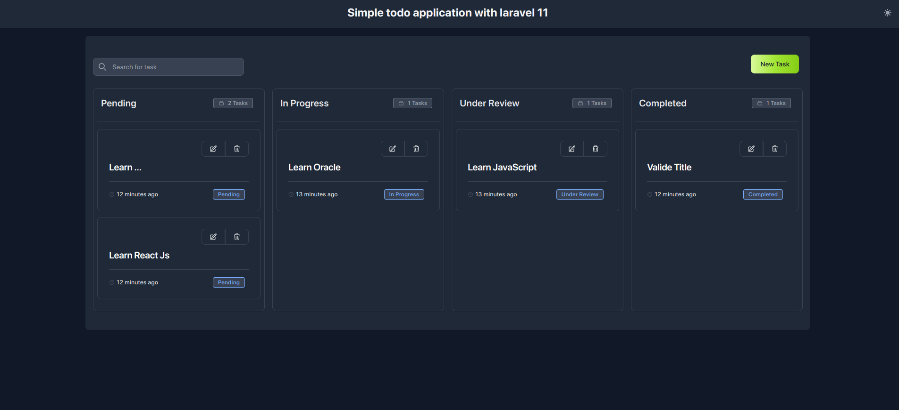
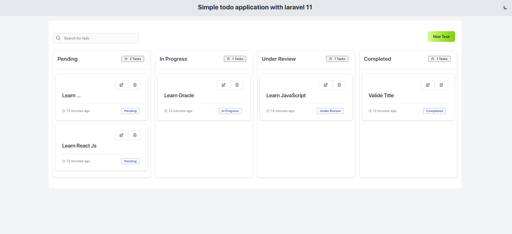

# To-Do Application

Welcome to the To-Do application! This is a simple task management app that allows users to create, read, update, and delete tasks. It uses an SQLite database to store task information and offers both dark mode and light mode for user interface customization.

 

## Features

-   **Task Management**: Add new tasks, update existing tasks, and remove completed tasks.
-   **SQLite Database**: All tasks are stored in an SQLite database, allowing for simple setup and management.
-   **Dark Mode / Light Mode**: Switch between dark and light modes to customize the user interface.

```

```
